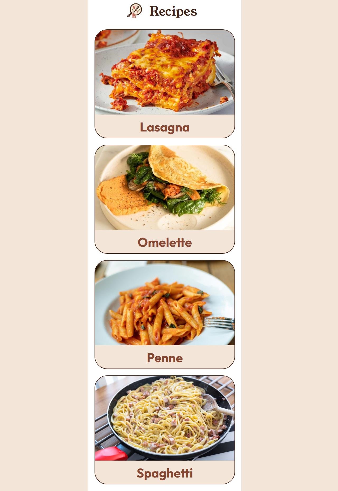
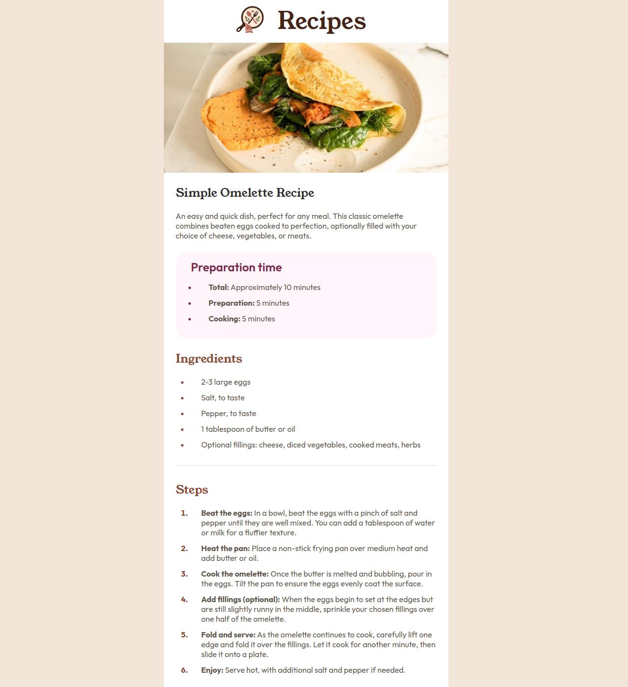

# Recipes

A simple recipe website built as part of **The Odin Project – Foundations**.

## Preview

### Live Demo

**Github Pages:** [https://brkahmed.github.io/recipes/](https://brkahmed.github.io/recipes/)

### Home page

### Recipe page

## Built With

### Web Site

- HTML5
- CSS3
- Google Fonts
  - Young Serif
  - Outfit

### Recipe Page Generation

- Python
- Markdown
- Jinja
- BeautifulSoup

The recipe data is written in Markdown and can be converted into the corresponding HTML recipe pages using the generation script.

## Credits

- [The Odin Project](https://www.theodinproject.com/) — project and learning curriculum
- [Frontend Mentor](https://www.frontendmentor.io/challenges/recipe-page-KiTsR8QQKm) — design inspiration
- Recipe and food images used in the project are included in the repository.

## License

This project is available under the [MIT License](./LICENSE).
