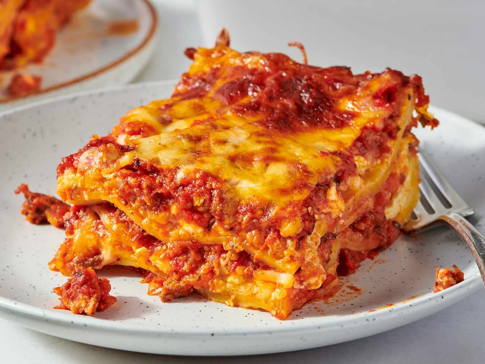

# Lasagna

## Description

This classic homemade lasagna features rich, savory layers of seasoned ground beef, vibrant marinara sauce, and a creamy three-cheese blend. It is the ultimate comfort food, combining tender pasta sheets with a golden, bubbly topping of melted mozzarella and parmesan cheese.

## Preparation time

- **Total:** Approximately 1 hour 20 minutes
- **Preparation:** 30 minutes
- **Cooking:** 50 minutes

## Ingredients

- 1 lb lean ground beef
- 1 medium yellow onion, finely diced
- 2 cloves garlic, minced
- 3 cups marinara or tomato sauce
- 9 to 12 classic lasagna noodles
- 15 oz ricotta cheese
- 1 large egg
- 3 cups shredded mozzarella cheese, divided
- 1/2 cup grated parmesan cheese, divided
- 1 tsp dried Italian seasoning
- Salt and black pepper, to taste

## Steps

1. **Prepare the oven and noodles:** Preheat the oven to 375°F (190°C) and cook the lasagna noodles according to the package instructions.

2. **Cook the beef and onion:** Heat a skillet over medium heat. Add the ground beef and diced onion, then cook until the beef is browned and the onion is softened. Drain any excess fat.

3. **Make the meat sauce:** Add the minced garlic, Italian seasoning, and marinara sauce to the skillet. Stir well and simmer for about 5 minutes to combine the flavors.

4. **Prepare the ricotta mixture:** In a bowl, combine the ricotta cheese, egg, 1/4 cup of parmesan cheese, and a pinch of salt until smooth.

5. **Assemble the lasagna:** Spread a layer of meat sauce in a 9x13-inch baking dish. Add a layer of noodles, followed by ricotta mixture, mozzarella cheese, and meat sauce. Repeat the layers until all the ingredients are used.

6. **Bake the lasagna:** Cover the dish with foil and bake for 45 minutes. Remove the foil and continue baking for another 5 minutes, until the cheese is golden and bubbly.

7. **Cool and serve:** Let the lasagna rest for 15 to 20 minutes before slicing. This allows the layers to set and makes serving easier.
