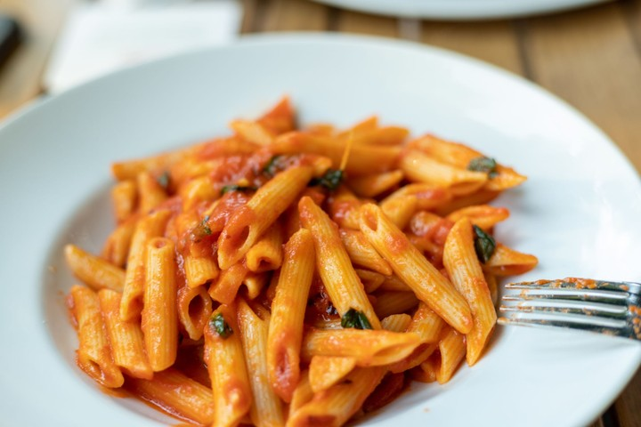

# Penne Recipe

## Description

Penne Arrabbiata is a vibrant, fiery staple of Roman cuisine. The name arrabbiata literally translates to angry in Italian, a playful nod to the punch of heat delivered by the crushed red pepper flakes infused into the sauce.

## Preparation time

- **Total:** Approximately 30 minutes
- **Preparation:** 15 minutes
- **Cooking:** 15 minutes

## Ingredients

- 1 lb (450g) penne pasta, preferably penne rigate with ridges
- 3 tablespoons extra-virgin olive oil
- 4 cloves garlic, thinly sliced
- 1 teaspoon crushed red pepper flakes, adjusted to your heat preference
- 1 can (28 oz) whole peeled San Marzano tomatoes, crushed by hand or finely chopped
- 1/4 cup fresh parsley, finely chopped
- Kosher salt and freshly ground black pepper, to taste
- Grated Pecorino Romano or Parmesan cheese, optional for serving

## Steps

1. **Cook the pasta:** Bring a large pot of heavily salted water to a boil. Add the penne and cook according to the package instructions until al dente.

2. **Heat the olive oil:** While the water is heating or the pasta is cooking, place a large skillet over medium heat and add the olive oil.

3. **Cook the garlic and pepper:** Add the thinly sliced garlic and crushed red pepper flakes to the skillet. Sauté gently for 1 to 2 minutes until the garlic is fragrant and just barely starting to turn golden. Do not let it brown, as it will become bitter.

4. **Make the sauce:** Carefully pour the hand-crushed tomatoes and their juices into the skillet. Season with salt and black pepper. Bring the sauce to a gentle simmer, reduce the heat to low, and cook for 10 to 15 minutes until the flavors meld and the sauce thickens slightly.

5. **Reserve the pasta water:** Reserve about 1/2 cup of the starchy pasta water, then drain the penne.

6. **Combine the pasta and sauce:** Transfer the cooked penne directly into the skillet with the spicy tomato sauce. Toss vigorously until every piece is coated. Add a splash of the reserved pasta water if the sauce is too thick.

7. **Finish and serve:** Stir in the chopped fresh parsley, remove from the heat, and serve immediately with a dusting of grated Pecorino Romano or Parmesan cheese, if desired.
