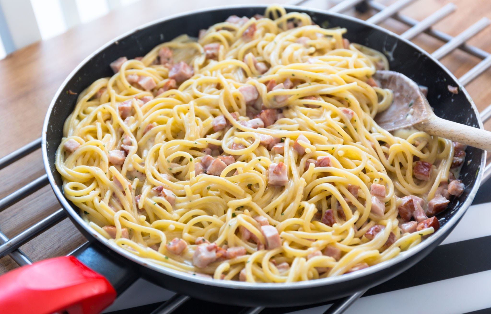

# Spaghetti

## Description

Spaghetti Carbonara is a traditional Roman pasta dish made with just a few simple, high-quality ingredients. It perfectly balances the richness of cured pork, sharp Pecorino Romano cheese, and a silky, egg-based sauce.

## Preparation time

- **Total:** Approximately 30 minutes
- **Preparation:** 10 minutes
- **Cooking:** 20 minutes

## Ingredients

- 1 lb (450g) spaghetti
- 5 oz (150g) guanciale or pancetta, diced
- 3 large eggs plus 1 egg yolk
- 1 cup (100g) Pecorino Romano cheese, finely grated
- 1/2 cup (50g) Parmigiano-Reggiano, finely grated
- Freshly ground black pepper, to taste
- Kosher salt, for the pasta water

## Steps

1. **Cook the spaghetti:** Bring a large pot of salted water to a rolling boil. Add the spaghetti and cook until just shy of al dente, about 1 minute less than the package instructions.

2. **Crisp the guanciale:** Place the diced guanciale in a large cold skillet. Turn the heat to medium-low and cook for 8 to 10 minutes, until the fat renders and the meat becomes crispy. Remove the skillet from the heat.

3. **Prepare the egg mixture:** In a medium mixing bowl, whisk together the eggs, egg yolk, Pecorino Romano, Parmigiano-Reggiano, and a generous amount of freshly ground black pepper until a thick paste forms.

4. **Reserve the pasta water:** Reserve about 1 cup of the starchy pasta water, then drain the spaghetti.

5. **Combine the pasta and guanciale:** Add the hot spaghetti directly to the skillet with the guanciale and rendered fat. Toss well to coat the pasta, keeping the skillet off the heat.

6. **Make the carbonara sauce:** Quickly pour the egg and cheese mixture over the pasta and toss vigorously and continuously. Add small splashes of the reserved pasta water as needed until a glossy, creamy sauce forms.

7. **Serve immediately:** Transfer the spaghetti to serving plates and garnish with extra grated cheese and freshly cracked black pepper.
